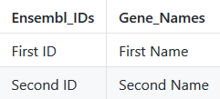

# Help

**Please visit the GitHub-Page for any further information!**

## 1. Upload .rds file

First of all you have to upload the .rds file, which contains the seurat object. Once the upload has completed, the app will process the data. Please wait until everything has finished.

## 2. Select genes

After the data from the .rds file has been processed, you are able to select genes through two methods:

### 2.1 Selecting genes with UI

If you use the UI to select genes, you will get a list of genes to select from.
In order to find certain genes you can simply just type in the name and/ or ensemblID.

### 2.2 Selecting genes with excel file

Create an excel file (.xlsx) which contains the ensemblIDs in the first column.  
Template:

Upload this file to the app and wait for the data to be processed.
Once processed the selected genes will be displayed and you can correct your selection.

## 3. Download

By default the download will contain every plot. If you only want certain plots you can uncheck the ones you don't want. You can rename the archive and hit download.
This can take a moment, because the .png and .pdf files have to be created.
 
